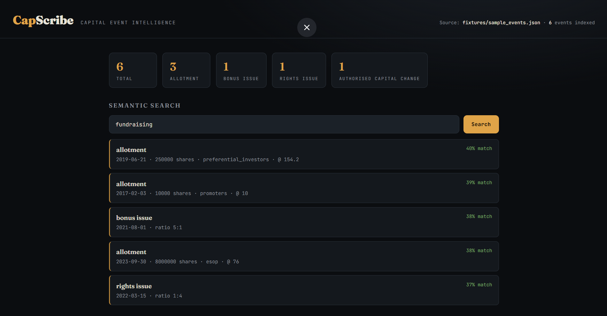
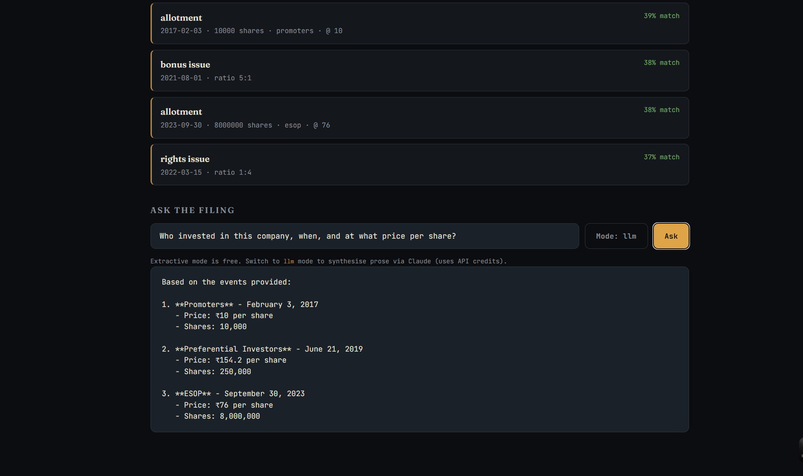

# CapScribe — Capital Event Intelligence

> Structured capital event extraction from DRHP/IPO filings using Claude AI.

[](https://github.com/Utkal059/capscribe/actions)

CapScribe parses dense regulatory PDF documents (DRHPs, IPO prospectuses, annual reports) and extracts structured capital event data — allotments, bonus issues, rights issues, authorised-capital changes, dividends, buybacks, and warrant exercises — into clean, machine-readable JSON. Every event is traceable back to the exact page and verbatim text it came from. Built for analysts, quant researchers, and fintech pipelines that need reliable signal from unstructured filings.

## Demo

### Semantic Search
Natural language query matching across capital event types — no keyword syntax required.



### Ask the Filing — LLM Mode
Structured investor intelligence synthesised from raw DRHP events via Claude.



## What it extracts

| Event Type | Fields Captured |
|---|---|
| Allotments | Date, shares, face value, issue price, consideration, allottee category |
| Bonus Issues | Date, ratio, pre/post share count |
| Rights Issues | Date, ratio, price, record date |
| Authorised Capital Changes | Date, from/to amount, resolution type |
| Dividends | Date, amount per share, record/payment date, total outflow |
| Share Repurchases | Date, shares bought back, remaining authority |
| Warrant Exercises | Date, warrants exercised, exercise price |

## Architecture

- **Extraction** — PDF parser producing structured JSON events per `schema.py`
- **Tables** — direct `pdfplumber` table extraction (`table_extractor.py`), merged-cell aware, preferred over LLM events on a fuzzy match
- **Markdown** — filings already converted to Markdown (`markdown_extractor.py`) skip pdfplumber/OCR entirely; their pipe tables are parsed straight into the same events, reusing every table-extraction precision guard
- **OCR** — scanned-page fallback (`ocr.py`) via tesseract, degrades gracefully when the binary is absent
- **Retrieval** — hybrid BM25 + ChromaDB vectors fused with reciprocal rank fusion (`retrieval.py`); an auto-alpha heuristic leans toward BM25 for numeric queries
- **Agent** — observable LangGraph state machine `retrieve → grade → synthesize → validate` (`agent.py`)
- **Verification** — deterministic contradiction checks: timeline / capital-continuity / bonus-arithmetic (`verification.py`)
- **Report** — source-backed capital-history brief with inline page citations (`report.py`)
- **API** — FastAPI service (`api.py`)
- **Frontend** — financial terminal UI (dark theme, semantic search, extractive + LLM QA, citation pills)

## API

| Endpoint | Purpose |
|---|---|
| `GET /health` | liveness; reports retrieval mode and `ocr_available` |
| `GET /stats` | event counts by type |
| `GET /events` | list events (optional `?event_type=` & `?limit=`) |
| `POST /search` | hybrid search `{query, k, alpha}` |
| `POST /ask` | agentic RAG `{question, mode}` (extractive / llm) |
| `POST /verify` | full-corpus contradiction report |
| `POST /report` | source-backed capital-history brief `{mode, title}` |
| `POST /ingest` | PDF or Markdown (`.md`) upload → OCR fallback (PDF) / direct table parse (Markdown) → table extraction (background job; `?llm=true` adds a bounded Claude pass) |
| `GET /ingest/status/{job_id}` | poll a running ingest job for its result |
| `POST /ingest/{job_id}/index` | promote an ingested filing to the live corpus (search / ask / verify / report) |
| `POST /index` | rebuild the index from a different extracted JSON |

> Markdown tables flow through the same precision guards as PDF-extracted tables (`table_to_events` reuse) — `.md` filings skip pdfplumber/OCR but share every detection and filtering rule.

## Evaluation

**Real document — Ola Electric DRHP** (allotment history tables, hand-verified gold set in `fixtures/ola_drhp_gold.json`):

| Metric | Score |
|---|---|
| Precision | 1.000 |
| Recall | 0.857 |
| F1 | 0.923 |

```bash
python evaluate.py fixtures/ola_drhp_extracted.json fixtures/ola_drhp_gold.json
```

Zero false positives — acquisition/transfer tables are correctly *not* typed as allotments (a mixed "date of allotment/transfer" table is filtered by its `nature of transaction` column). The single miss is a genuine allotment whose share count appears only in prose (no numeric column); the optional `POST /ingest?llm=true` pass recovers that class of event.

**Synthetic fixture** (full event-type coverage, known answers): Precision **1.000** · Recall **0.938** · F1 **0.968** via `python evaluate.py fixtures/sample_events.json fixtures/gold_events.json`.

### Multi-filing corpus

One filing isn't enough evidence. `eval_corpus.py` scores extraction across a
corpus of real DRHPs and prints per-filing **and** aggregate P/R/F1, so a
regression on one filing surfaces even if another still scores 1.0:

```bash
python eval_corpus.py
```

It always scores the committed Ola baseline, and consumes any DRHP PDFs dropped
into `fixtures/real_drhps/`. To add a filing + gold set, see
[`fixtures/real_drhps/README.md`](fixtures/real_drhps/README.md): drop the PDF,
run the harness to generate predictions, hand-verify against the filing, save a
`<name>.gold.json`, and re-run. Filings without a gold set are listed as
"no gold set" rather than scored — numbers are never invented.

### Robustness

Header matching is punctuation/spacing-insensitive (`No.` vs `Number`,
hyphenation), number parsing handles Indian grouping, `Rs.`/`INR`/`₹`, and
shorthand magnitude words (`150 crore`), and date parsing covers many real
formats plus footnote markers (`2023-12-19*`). The bonus/rights branches require
a record/allotment-date column (so a "Debt-Equity Ratio 2:1" financial table is
never mis-typed), and rights are split from bonus on an explicit section signal.
The precision guards (strict allotment-date column, `nature of transaction`
filter, `increased from/to` + magnitude floor) keep acquisition, transfer, and
ratio tables out of the event stream. OCR usage on the most recent ingest is
visible at `GET /health` (`ocr_last_ingest`) and in the server logs.

Per-event-type and per-extraction-method breakdowns are emitted by `evaluate.py`; retrieval quality (nDCG@5, MRR — dense vs hybrid) by `benchmark_retrieval.py`.

## Quickstart

```bash
cp .env.example .env          # add ANTHROPIC_API_KEY (only needed for llm modes)
pip install -r requirements.txt -r requirements-api.txt
uvicorn api:app --reload
# open http://localhost:8000
```

The index builds on startup from `fixtures/ola_drhp_extracted.json` — the **real Ola Electric DRHP** extraction — using local embeddings, so search / ask / verify / report all run on a genuine, page-cited filing with **zero API spend**. Override the seed with `EVENTS_PATH` in `.env` (e.g. `fixtures/sample_events.json` for full event-type coverage). Only `mode="llm"` calls Claude.

## Tests

```bash
pip install -r requirements.txt -r requirements-api.txt -r requirements-dev.txt
pytest -q   # 76 passed
```

## Eval & Benchmarks

```bash
python evaluate.py fixtures/sample_events.json fixtures/gold_events.json
python benchmark_retrieval.py          # nDCG@5 + MRR, dense vs hybrid
```

## License

MIT
